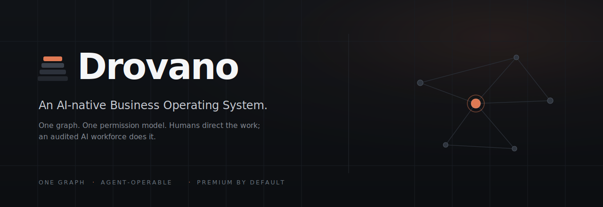
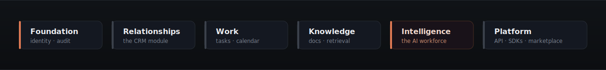

<p align="center">
  
</p>

<p align="center">
  <a href="./ROADMAP.md"></a>
  <a href="package.json"></a>
  
  
  
</p>

<p align="center">
  <b>The single place a business runs</b> — its relationships, deals, work,
  knowledge, and&nbsp;its&nbsp;AI&nbsp;workforce.<br/>
  CRM is the first module, not the product.
</p>

---

## The bet

Software built **AI-native** — where every object, permission, and action is
designed to be operated by both humans and AI agents — will replace suites
where AI is a bolted-on feature. The unit of value shifts from _"a system of
record you update"_ to _"a system that runs work for you and shows you the
record."_

> The company that owns the unified business graph — people, companies, deals,
> work, documents, conversations — in **one permission model** will own the AI
> workforce layer, because agents are only as good as the context and the
> levers they are given.

## One platform, one graph, many modules

<p align="center">
  
</p>

Every module obeys three laws:

|       | Law                    | What it means                                                                                                                                                  |
| ----- | ---------------------- | -------------------------------------------------------------------------------------------------------------------------------------------------------------- |
| **1** | **One graph**          | Every record can relate to every other record; context is never trapped in a module.                                                                           |
| **2** | **Agent-operable**     | Every action a human can take is a typed, permissioned, audited operation an AI worker can take — same authorization rules, always attributable, never silent. |
| **3** | **Premium by default** | Fast, keyboard-first, beautiful, accessible. Software people _want_ to live in.                                                                                |

## Who it's for

SMB and mid-market **B2B teams (5–200 seats)** who have outgrown spreadsheets
and lightweight CRMs but find enterprise suites heavy, ugly, and dumb. The
buyer is a founder, RevOps lead, or head of sales; the daily user is anyone who
touches customers.

## Design — "Strata"


Drovano ships on its own design language, **Strata**: premium is _restraint
plus consistency_. A single warm **ember** accent for actions, selection, and
focus; a cool graphite neutral ramp for everything else; structure drawn with
**hairlines and light, not shadows**. Dark and light are co-equal, WCAG 2.2 AA
is encoded in tokens, and the interaction model is keyboard-first.

See [`DESIGN_SYSTEM.md`](./DESIGN_SYSTEM.md) for the ten absolute rules.

## Repository

This is a **pnpm + Turborepo** monorepo.

```text
apps/
  api        · tRPC API surface
  realtime   · realtime/sync service
  web        · web client
packages/
  ai             · AI workers, retrieval, embeddings
  api-contracts  · shared tRPC / schema contracts
  db             · data graph + tenant isolation
  modules        · business modules (CRM, work, knowledge…)
  permissions    · the one permission model
  telemetry      · observability
  tokens         · Strata design tokens (OKLCH, DTCG)
  ui             · owned, accessible component library
```

## Getting started

```bash
pnpm install          # install the workspace
pnpm build            # turbo build across packages
pnpm typecheck        # strict TS across the repo
pnpm test             # run the test suites
pnpm lint             # eslint, zero warnings
```

## Documentation

Drovano is documentation-first. Start here:

| Doc                                                                                                            | What's inside                            |
| -------------------------------------------------------------------------------------------------------------- | ---------------------------------------- |
| [`PROJECT.md`](./PROJECT.md)                                                                                   | Vision, the bet, product principles      |
| [`ARCHITECTURE.md`](./ARCHITECTURE.md)                                                                         | Technical shape of the system            |
| [`ROADMAP.md`](./ROADMAP.md)                                                                                   | Milestones (implementation begins at M1) |
| [`DESIGN_SYSTEM.md`](./DESIGN_SYSTEM.md)                                                                       | Strata — the design contract             |
| [`DECISIONS.md`](./DECISIONS.md)                                                                               | Indexed ADRs                             |
| [`CODING_STANDARDS.md`](./CODING_STANDARDS.md) · [`TESTING.md`](./TESTING.md) · [`SECURITY.md`](./SECURITY.md) | Non-negotiable quality bars              |
| [`CONTRIBUTING.md`](./CONTRIBUTING.md)                                                                         | How to contribute                        |

## Status

**Pre-code.** The engineering foundation (this repository's documentation set)
is complete; implementation begins with milestone **M1** per
[`ROADMAP.md`](./ROADMAP.md).

---

<p align="center">
  <sub>© Drovano · UNLICENSED · Brand artwork in <code>assets/brand/</code></sub>
</p>
